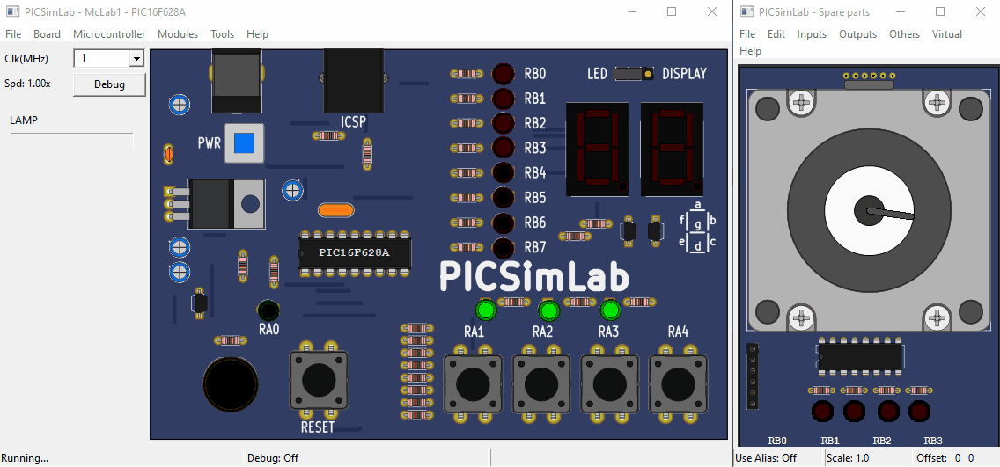

## My PICSimLab Examples

Repository of my projects created in the [PICSimLab](https://github.com/lcgamboa/picsimlab) simulator used for learning Assembly and C/C++ programming languages ​​for PIC/AVR microcontrollers.

Some examples here are old (2007) and from my college days.
Feel free to use it as study material. ;)

(in brazilian portuguese)

Repositório dos meus projetos criados no simulador [PICSimLab](https://github.com/lcgamboa/picsimlab) utilizado para aprendizagem das linguagens de programação Assembly e C/C++ para microcontroladores PIC/AVR.

Alguns exemplos (exercícios) aqui são antigos (2007) e da época da faculdade.
Sinta-se à vontade para usá-lo como material de estudo. ;)


## Board McLab1

Esta é uma placa com o PIC16F628A, destinada aos usuários que estão começando no mundo do PIC.
Com ela você será capaz de realizar todas as experiências existentes no livro "Desbravando o PIC",
além de aperfeiçoar e inventar seus próprios experimentos.




## Exemplos do Curso de Extensão

Esses exemplos são do meu curso da faculdade utilizando Linguagem Assembly para o microcontrolador PIC16F628A.
Os exercícios foram elaborados pelo Prof. Emerson Martins para a disciplina programação de microcontroladores, e os códigos são de minha autoria e podem ser utilizados como material de estudo.

Como material de apoio utilizei o livro "Desbravando o PIC" do autor David José de Souza.

### Exemplo 01
```asm
;*---------------------------------------------------------------------------*
;* EXEMPLO 01 - CONTADOR CRESCENTE POR PULSOS COM DISPLAY DE 7 SEGMENTOS     *
;*---------------------------------------------------------------------------*
;* CONTADOR CRESCENTE DE 0 A F, APLICANDO PULSOS POSITIVOS NO BOTÃO RA1.     *
;* O VALOR DO CONTADOR DEVERÁ SER MOSTRADO EM UM DISPLAY DE 7 SEGMENTOS,     *
;* QUANDO O VALOR CHEGAR A F DEVERÁ VOLTAR A ZERO.                           *
;* * * * * * * * * * * * * * * * * * * * * * * * * * * * * * * * * * * * * * *
```

### Exemplo 02
```asm
;*---------------------------------------------------------------------------*
;* EXEMPLO 02 - CONTADOR POR PULSOS E TEMPORIZADOR                           *
;*---------------------------------------------------------------------------*
;* CONTADOR POR PULSOS ATÉ 3, APLICANDO PULSOS NEGATIOS EM RA1, AO CHEGAR    *
;* A ESSE VALOR DEVE ACIONAR UM LED QUE FICARÁ ACESO POR 5 SEGUNDOS E        *
;* EM SEGUIDA DESLIGAR O LED.                                                *
;* * * * * * * * * * * * * * * * * * * * * * * * * * * * * * * * * * * * * * *
```

### Exemplo 03
```asm
;*---------------------------------------------------------------------------*
;* EXEMPLO 03 - CONTROLE DE NÍVEL                                            *
;*---------------------------------------------------------------------------*
;* CONTROLE DE NÍVEL UTILIZANDO DOIS SENSORES, QUANDO O LÍQUIDO CHEGAR AO    *
;* NÍVEL MÁXIMO (RA4) DEVERÁ DESLIGAR A BOMBA, QUANDO CHEGAR AO NÍVEL        *
;* MÍNIMO (RA3) DEVERÁ LIGAR A BOMBA, E SE POR ALGUM MOTIVO À ÁGUA ABAIXAR   *
;* O NÍVEL MÍNIMO E CHEGAR AO NÍVEL CRÍTICO (RB0) DEVERÁ LIGAR O LED (RB2)   *
;* SIMULANDO UM ALARME UTILIZANDO INTERRUPÇÃO EM RB0.                        *
;* * * * * * * * * * * * * * * * * * * * * * * * * * * * * * * * * * * * * * *
```

### Exemplo 04
```asm
;*---------------------------------------------------------------------------*
;* EXEMPLO 04 - CONTADOR DECRESCENTE TEMPORIZADO                             *
;*---------------------------------------------------------------------------*
;* CONTADOR TEMPORIZADO, QUE DECREMENTA O VALOR A CADA UM SEGUNDO,           *
;* MOSTRANDO O VALOR NO DISPLAY 7 SEGMENTOS NO PORTB. (VALOR INICIAL = 9)    *
;* * * * * * * * * * * * * * * * * * * * * * * * * * * * * * * * * * * * * * *
```

### Exemplo 05
```asm
;*---------------------------------------------------------------------------*
;* EXEMPLO 05 - CONTROLE SIMPLES DE MOTOR DE PASSO                           *
;*---------------------------------------------------------------------------*
;* CONTROLE SIMPLES DE MOTOR DE PASSO COM DUAS VELOCIDADES PARA A DIREITA    *
;* E DUAS VELOCIDADES PARA A ESQUERDA.                                       *
;* RA1 - ESQUERDA RÁPIDO                                                     *
;* RA2 - ESQUERDA LENTO                                                      *
;* RA3 - DIREITA LENTO                                                       *
;* RA4 - DIREITA RÁPIDO                                                      *
;* * * * * * * * * * * * * * * * * * * * * * * * * * * * * * * * * * * * * * *
```

### Exemplo 06
```asm
;*---------------------------------------------------------------------------*
;* EXEMPLO 06 - ROTINA PARA ACIONAR A INTERRUPÇÃO RB0                        *
;*---------------------------------------------------------------------------*
; AO ACIONAR A INTERRUPÇÃO RB0 ATRAVÉS DO BOTÃO EM RB0, A LAMPADA QUE ESTÁ   *
; EM RA0 DEVERÁ ACENDER.                                                     *
;* * * * * * * * * * * * * * * * * * * * * * * * * * * * * * * * * * * * * * *
```

### Exemplo 07
```asm
;*---------------------------------------------------------------------------*
;* EXEMPLO 07 - ROTINA PARA ACIONAR A INTERRUPÇÃO RB0 E RB4                  *
;*---------------------------------------------------------------------------*
; AO LIGAR A PLACA ACIONA A INTERRUPÇÃO RB4 ONDE DEVERÁ ACENDER A LÂMPADA EM *
; RA0 E UMA OUTRA INTERRUPÇÃO EM RB0 AO SER ACIONADO ATRAVÉS DO BOTÃO DEVERÁ *
; ACIONAR O ALARME (BUZZER) LIGADO EM RB1.                                   *
;* * * * * * * * * * * * * * * * * * * * * * * * * * * * * * * * * * * * * * *
```

### Exemplo 08
```asm
;*---------------------------------------------------------------------------*
;* EXERCÍCIO 08 - ROTINA PARA ACIONAR A INTERRUPÇÃO RB0 E RB4                *
;*---------------------------------------------------------------------------*
;* ADICIONAR ALGUMA PARTE NO SIMULADOR PARA TESTAR MELHOR A ROTINA.          *
;* * * * * * * * * * * * * * * * * * * * * * * * * * * * * * * * * * * * * * *
```

### Exemplo 09
```asm
;*---------------------------------------------------------------------------*
;* EXERCÍCIO 09 - ROTINA PARA ACIONAR O LED APÓS 250MS AO LIGAR O PIC        *
;*---------------------------------------------------------------------------*
;* AUMENTAR O TEMPO PARA CONSEGUIR VISUALIZAR MELHOR O ACIONAMENTO DO LED    *
;* * * * * * * * * * * * * * * * * * * * * * * * * * * * * * * * * * * * * * *
```


## Anotações (material de apoio)

### REGISTRADOR 4.3: INTCON - REGISTRADOR DE CONTROLE DE INTERRUPÇÃO

ENDEREÇO: 0Bh, 8Bh, 10Bh, 18Bh

R/W-0   R/W-0   R/W-0   R/W-0   R/W-0   R/W-0   R/W-0   R/W-x
GIE     PEIE    T0IE    INTE    RBIE    T0IF    INTF    RBIF
bit 7                                                   bit 0

bit 7   GIE: Bit de Habilitação de Interrupção Global
        1 = habilita todas as interrupções não-mascaradas
        0 = desabilita todas as interrupções

bit 6   PEIE: Bit de Habilitação de Interrupção Periférica
        1 = habilita todas as interrupções periféricas não-mascaradas
        0 = desabilita todas as interrupções periféricas

bit 5   T0IE: Bit de Habilitação de Interrupção por Overflow no TMR0
        1 = habilita a interrupção do TMR0
        0 = desabilita a interrupção do TMR0

bit 4   INTE: Bit de Habilitação de Interrupção Externa do RB0/INT
        1 = habilita a interrupção externa do RB0/INT
        0 = desabilita a interrupção externa do RB0/INT

bit 3   RBIE: Bit de Habilitação de Interrupção por Alteração da Porta RB
        1 = habilita interrupção por alteração da porta RB
        0 = desabilita interrupção por alteração da porta RB

bit 2   T0IF: Bit Sinalizador de Interrupção Overflow no TMR0
        1 = o registrador TMR0 sofreu overflow (deve ser apagado pelo software)
        0 = o registrador TMR0 não sofreu overflow

bit 1   INTF: Bit Sinalizador de Interrupção Externa do RB0/INT
        1 = ocorrida a interrupção externa do RB0/INT (deve ser apagado pelo software)
        0 = não ocorrida a interrupção externa do RB0/INT

bit 0   RBIF: Bit de Sinalização de Interrupção por Alteração da Porta RB
        1 = quando pelo menos um dos pinos RB<7:4> tem seu estado alterado (deve ser apagado pelo software)
        0 = nenhum dos pinos RB<7:4> teve seu estado alterado


## Tools

- [PICSimLab 0.8.9](https://github.com/lcgamboa/picsimlab/releases/tag/v0.8.9)
- [MPASM v5.51](https://ww1.microchip.com/downloads/en/DeviceDoc/MPLAB_IDE_8_92.zip)
- [Sublime Text 3](https://www.sublimetext.com/3)
- [Sublime MPASM Package](packages/MPASM.sublime-build)


## License

Esses exemplos são de domínio público, pois são apenas para fins educacionais.

These examples are in the Public Domain, because they are for educational purposes only.
